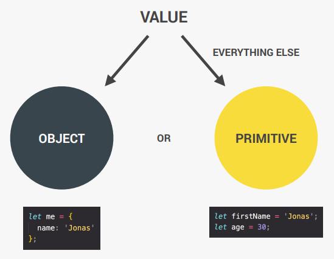

- The `value` in JavaScript can be either an `object` or a `primitive` type. A value is considered `primitive` when it is not an `object`.

  

# 7 Primitive Data Types in JavaScript

1. **Number**: Floating point numbers 👉🏻 Used for decimals and integers. Example: `let age = 23` => `23.0`. All numbers are simply of type `number`.
2. **String**: Sequence of characters 👉🏻 Used for text. Example: `""` or `''`.
3. **Boolean**: Logical type that can only be `true` or `false` 👉🏻 Used for making decisions.

   -- and these are the most important data types --

4. **Undefined**: Represents a variable that has been declared but has not been assigned a value. Means empty value.
5. **Null**: Represents the intentional absence of any object value. Also means empty value.
6. **Symbol** (ES2015): Represents a unique identifier that is not equal to any other value and cannot be changed.
7. **BigInt** (ES2020): Represents integers with arbitrary precision.

These primitive data types are the building blocks of JavaScript and are used to store and manipulate different kinds of data in a program.

`JavaScript has dynamic typing: We do not have to manually define the data type of the value stored in a variable. Instead, data types are determined automatically.` 🔴 Value has the type, not the variable.

  

An important application of dynamic typing is that later in our code, we can assign a new value with a different data type to the same variable without a problem.

For example, a variable `x` can initially be a number and then later a string. This flexibility can be very useful, but it can also be the source of some difficult-to-find bugs, which means errors in our code.
